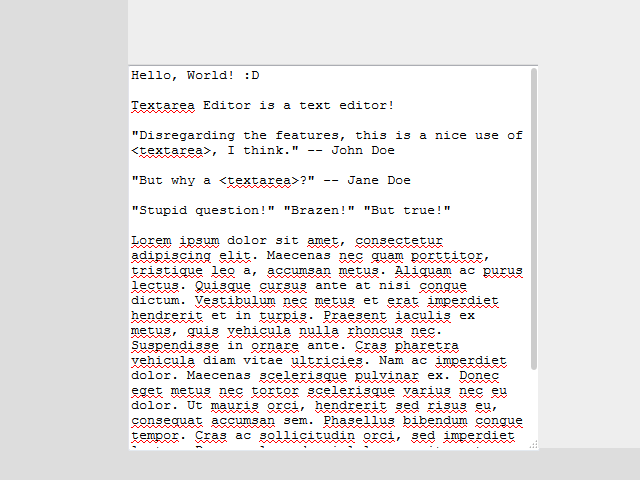

# Textarea Editor
An extensible editor which, at its core, is an HTML `<textarea>` (hence the name) and sizeable panels, and browser JavaScript modules to add real functionality to it.

Link: https://schas002.github.io/Textarea-Editor/

